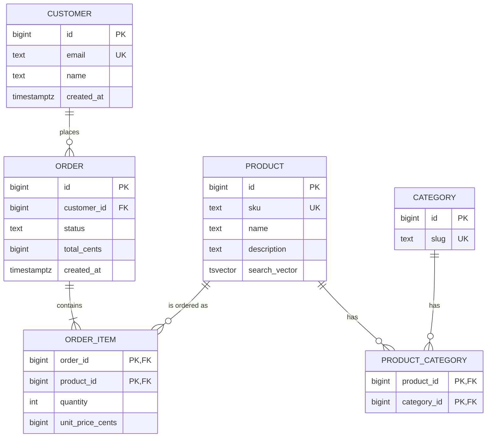

# Database Design

Database design turns a domain into a schema that stays fast, correct, and easy to evolve for years. This skill covers the full pipeline — requirements analysis, entity modeling, normalization, keys, constraints, indexes, and safe migrations — plus deciding when a document, wide-column, or graph store beats a relational database.

## Quick Reference

| Topic | Reference |
|-------|-----------|
| Normalization worked examples, natural vs surrogate keys, UUID vs bigint | [normalization-and-keys.md](references/normalization-and-keys.md) |
| B-tree internals, composite/covering/partial indexes, reading EXPLAIN | [indexing-and-query-tuning.md](references/indexing-and-query-tuning.md) |
| Migration tools (Alembic, Prisma, Flyway), expand-contract, backfilling | [migrations-zero-downtime.md](references/migrations-zero-downtime.md) |

## Core Workflow

Work through these steps in order — each informs the next, and skipping requirements analysis is the most common source of bad schemas.

1. **Gather requirements.** List entities, attributes, and relationships. Note cardinalities and whether each read is CRUD (single-row) or reporting (aggregate). Ask about scale, growth, retention, and compliance (e.g. GDPR erasure).
2. **Model entities and relationships.** Draw an ER sketch. Normalize to 3NF by default; denormalize only later, with a measured reason.
3. **Choose keys.** Prefer surrogate `BIGINT IDENTITY` primary keys unless a natural key is genuinely stable. Decide UUID vs bigint now — changing it later is painful.
4. **Add constraints.** NOT NULL, UNIQUE, CHECK, defaults, and foreign keys belong in the database, not just in the ORM.
5. **Design indexes.** Start with the indexes backing PK/FK/UNIQUE constraints, then add query-driven indexes for the hot paths found in step 1.
6. **Validate with EXPLAIN.** Run `EXPLAIN (ANALYZE, BUFFERS)` against realistic data. Fix the plan, not the schema, before considering denormalization.
7. **Plan migrations.** Versioned migrations in code; expand-contract for anything touching a live table. Never hand-edit production.

## Requirements Analysis

Collect these before writing a single `CREATE TABLE`:

| Question | Why it matters |
|---|---|
| What are the entities and their attributes? | Defines tables and columns |
| What are the relationships and cardinalities? | 1:1, 1:N, M:N (junction table) |
| Required or optional attributes? | NOT NULL vs NULLable |
| Is a read CRUD or reporting? | CRUD wants normalized lookups; reporting wants aggregates, maybe denormalized |
| Write volume and read/write ratio? | Drives index count and normalization level |
| Data growth and retention? | Partitioning, archival, time-series decisions |
| Consistency requirements? | Isolation levels; whether eventual consistency is acceptable |
| Compliance (GDPR, HIPAA, finance)? | Audit columns, soft vs hard deletes, retention rules |

**CRUD vs reporting reads** want opposite schema shapes: CRUD queries touch few rows, narrow columns, and normalized tables; reporting wants few tables, wide pre-joined rows, and precomputed aggregates. If both matter, keep the OLTP schema normalized and serve reporting from a separate path (materialized views, a read replica, or a warehouse). **Cardinality:**

| Relationship | Model |
|---|---|
| 1:1 | FK with UNIQUE, or merge into one table when always accessed together |
| 1:N | Foreign key on the "many" side |
| M:N | Junction table with two FKs, composite PK over both |

## Normalization (1NF–3NF)

Normalization removes redundancy so each fact is stored and updated in exactly one place.

| Form | Rule | Typical violation | Fix |
|---|---|---|---|
| 1NF | Atomic values; no repeating groups | `phones` column holding "555-1,555-2" | Child table, one row per value |
| 2NF | No partial dependency on part of a composite key | `order_item` storing `product_name` (depends only on `product_id`) | Move it to `product` |
| 3NF | No transitive dependency on a non-key column | `order` storing `customer_city` (depends on `customer_id`, not `order_id`) | Move it to `customer` |

Normalize to 3NF by default. **Denormalize deliberately** — copy or aggregate data to serve a specific hot read — only when a measured query needs it. The costs are real: write amplification (every write maintains the copies), risk of drift, and backfill work whenever the derivation logic changes. Full worked example from spreadsheet to 3NF: [normalization-and-keys.md](references/normalization-and-keys.md).

## Keys

**Natural vs surrogate:**

| | Natural key | Surrogate key |
|---|---|---|
| Examples | `isbn`, `email`, `slug`, `country_code` | `id BIGINT GENERATED ALWAYS AS IDENTITY` |
| Pros | Meaningful, real-world stable, no extra column for lookups | Never changes, compact, no domain coupling, DB-generated |
| Cons | Can change or be re-issued; may be long or non-uniform | Meaningless (still need UNIQUE business keys); opaque joins |
| Role | Add as a UNIQUE business key | **Primary key** for most tables |

**Foreign keys and referential actions:**

| Action | Behavior | Use when |
|---|---|---|
| `RESTRICT` / `NO ACTION` | Refuse to delete a referenced row | Default; safest |
| `CASCADE` | Delete children with the parent | Owner-child lifecycles (order → items); audit the blast radius first |
| `SET NULL` | Null out the child FK | Optional references (deleted user keeps orders) |

**UUID vs bigint** (full comparison in [normalization-and-keys.md](references/normalization-and-keys.md)): bigint is 8 bytes, sequential, and cache-friendly — prefer it for high-write OLTP. UUIDv7 (time-ordered) is the choice for distributed or client-generated IDs where a central sequence is impossible. Avoid random UUIDv4 as a PK on hot tables: random inserts thrash the B-tree and bloat indexes.

## Indexing

A B-tree index is an ordered copy of one or more columns that lets the engine find rows without scanning the whole table — O(log n) equality lookups and efficient range scans. Design indexes for your *queries*, not for every column.

- **Composite index column order matters.** Put equality columns first, then range/ORDER BY columns: `(customer_id, created_at)` serves `WHERE customer_id = ? AND created_at > ?`. A leading range column makes the later columns useless for lookups.
- **Covering indexes** include every column the query touches (`INCLUDE (status)`) so the engine can answer from the index alone (index-only scan).
- **Partial indexes** carry a `WHERE` clause — e.g. `WHERE status = 'pending'` — keeping a hot subset small: faster scans, fewer writes to maintain.
- **When an index hurts:** every INSERT/UPDATE/DELETE maintains every index on the table (write amplification); indexes consume disk and buffer cache; unused indexes still cost writes. Remove indexes no query uses.
- **EXPLAIN is the source of truth.** `EXPLAIN (ANALYZE, BUFFERS)` on a slow query shows Seq Scan vs Index Scan vs joins and where time actually goes. Reading guide: [indexing-and-query-tuning.md](references/indexing-and-query-tuning.md).

## Constraints

Constraints make the database enforce your invariants, so app bugs and concurrent writers cannot corrupt data:

| Constraint | Example | Purpose |
|---|---|---|
| `NOT NULL` | `email TEXT NOT NULL` | Column is always present |
| `UNIQUE` | `UNIQUE (tenant_id, slug)` | No duplicates within scope |
| `CHECK` | `CHECK (quantity > 0)` | Value sanity and business rules |
| `DEFAULT` | `created_at TIMESTAMPTZ NOT NULL DEFAULT now()` | Fills values on insert |
| Foreign key | `FOREIGN KEY (customer_id) REFERENCES customers(id)` | Referential integrity |
| `EXCLUDE` (PostgreSQL) | `EXCLUDE USING gist (room WITH =, during WITH &&)` | No overlapping reservations |

Why they belong in the DB rather than the ORM: enforced under concurrency, enforced for every code path (imports, ad-hoc SQL, future apps), and they document the schema's contract. ORM-level validation is a convenience; DB constraints are the guarantee.

## Transactions and Isolation

ACID transactions keep multi-step writes atomic. The isolation level is a consistency-vs-throughput tradeoff:

| Level | Prevents | Can still see |
|---|---|---|
| Read committed (default in PostgreSQL/MySQL) | Dirty reads | Non-repeatable reads, phantoms |
| Repeatable read | Dirty and non-repeatable reads | Phantoms (PostgreSQL also prevents these here) |
| Serializable | Dirty, non-repeatable, phantoms, write skew | — (at a concurrency cost) |

**Locking strategies:**

- **Pessimistic:** `SELECT ... FOR UPDATE` locks rows so no one else modifies them until commit. Simple to reason about; hurts under contention.
- **Optimistic:** read a `version`/rowversion column and UPDATE only if unchanged (`WHERE version = ?`), retrying on conflict. Scales better; needs retry logic.

Rule of thumb: start at read committed; raise the level only for a concrete anomaly (e.g. financial invariants); prefer optimistic locking over long-held locks.

## Migrations

Schema changes are code: versioned, reviewed, tested, and applied exactly once in order. Tools: **Alembic** (Python/SQLAlchemy), **Prisma Migrate** (TypeScript), **Flyway** (SQL-first, JVM/CLI).

```bash
# Alembic
alembic revision --autogenerate -m "add orders table"
alembic upgrade head

# Prisma
prisma migrate dev --name add_orders

# Flyway (versioned SQL files, e.g. V2__add_orders.sql)
flyway migrate
```

**Expand–contract** (a.k.a. expand–migrate–contract) is the zero-downtime pattern for anything touching a live table:

1. **Expand** — add the new column/table as additive (nullable or new); deploy code that writes both old and new.
2. **Backfill** — populate the new structure in bounded batches without blocking writes.
3. **Contract** — switch reads, then writes, then drop the old structure once nothing references it.

```sql
-- 1. Expand: add nullable column, dual-write in the app
ALTER TABLE orders ADD COLUMN total_cents BIGINT;

-- 2. Backfill in batches
UPDATE orders SET total_cents = /* recompute from items */
WHERE id BETWEEN :start AND :end AND total_cents IS NULL;

-- 3. Contract: flip reads, then drop the old column
ALTER TABLE orders ALTER COLUMN total_cents SET NOT NULL;
-- later: ALTER TABLE orders DROP COLUMN legacy_total;
```

**Backfilling** runs in bounded batches (`WHERE id > :last_id ORDER BY id LIMIT 1000`) so it neither locks the table for minutes nor floods the WAL. Never backfill a large table with a single unbounded UPDATE. Full guide with locking gotchas: [migrations-zero-downtime.md](references/migrations-zero-downtime.md).

## SQL vs NoSQL

Start from the workload, not the hype:

| Store | Strengths | Pick when | Avoid when |
|---|---|---|---|
| Relational (PostgreSQL, MySQL) | Joins, transactions, constraints, ad-hoc queries | Data has relationships and invariants; reporting; money | Horizontal write scale beyond a single DB is the top need |
| Document (MongoDB) | Flexible schemas, natural aggregates, fast single-doc reads | Document-shaped data, read-mostly, evolving attributes | Cross-document transactions/joins are core; strong invariants |
| Wide-column (Cassandra, DynamoDB) | Linear read/write scale, partition-friendly | Known access patterns, huge scale, time-series at scale | Ad-hoc queries, joins, evolving query patterns |
| Graph (Neo4j) | Traversal of relationships | Deep relationship queries (fraud, social, routing) | Simple CRUD, bulk reporting |

A pragmatic middle path: keep the relational DB as the system of record and add specialized stores (search, cache, analytics warehouse) around it — don't fork the domain model across stores unnecessarily.

## Practical Patterns

| Pattern | How | Gotchas |
|---|---|---|
| JSON columns | `data JSONB` for rarely-queried flexible attributes; GIN index only if you filter on them | Don't put query-critical or joined data in JSON |
| Full-text search | PostgreSQL `tsvector` + GIN, MySQL `FULLTEXT` | Move to OpenSearch/Elasticsearch past ~1M docs or for ranking complexity |
| Time-series | TimescaleDB hypertables or range partitioning by time | Keep recent partitions small; retention via `DROP PARTITION` |
| Soft deletes | `deleted_at TIMESTAMPTZ NULL` | Breaks UNIQUE constraints and FKs — filter everywhere, or hard delete + audit table |
| Audit columns | `created_at`, `updated_at`, `created_by`; triggers or ORM callbacks | `updated_at` needs a trigger for raw-SQL writes; full history needs event sourcing |
| N+1 prevention | JOINs, `IN (...)` batching, ORM eager loading | N+1 = 1 query for N parents + N queries for children |

```sql
-- N+1 anti-pattern: 1 query for orders + N queries for order_items. Fix: one query
SELECT o.*, oi.*
FROM orders o
JOIN order_items oi ON oi.order_id = o.id
WHERE o.customer_id = $1;
```

## Worked Example: Small E-Commerce

Domain: customers, products (each in many categories), orders (many items, each item is one product). Requirements: order CRUD, product browsing by category, "recent orders for a customer" reporting, and a search box.



Key decisions:

- **Keys:** surrogate `bigint` PKs everywhere; `sku`, `email`, `slug` as UNIQUE natural keys for lookups.
- **Normalization:** 3NF — `product` and `category` are separate with a junction table. `orders.total_cents` is a *deliberate* denormalized aggregate, recomputed in the same transaction as its items.
- **Constraints:** CHECK `quantity > 0` and `unit_price_cents >= 0`; CHECK on `status`; FK `ON DELETE RESTRICT` for products/categories, `CASCADE` for order items; the junction's composite PK already enforces uniqueness.
- **Indexes:**

```sql
-- Hot paths
CREATE INDEX idx_orders_customer_created ON orders (customer_id, created_at DESC); -- "recent orders" (equality first, then sort)
CREATE INDEX idx_order_items_order ON order_items (order_id);                      -- order detail
CREATE INDEX idx_products_search ON products USING gin (search_vector);            -- search box (tsvector kept fresh by a trigger)
CREATE INDEX idx_orders_status_created ON orders (status, created_at)
    WHERE status = 'pending';                                                      -- partial: tiny fulfillment queue
```

The composite `(customer_id, created_at)` serves both `WHERE customer_id = ?` and `ORDER BY created_at DESC`. The partial index stays tiny because only pending orders enter the queue.

## Anti-Patterns to Avoid

- **No requirements analysis** — building tables before knowing queries, cardinalities, and read patterns.
- **Premature denormalization** — copying data "for performance" before EXPLAIN shows a problem.
- **Mutable natural keys as PK** (`email`, `username`) — churn breaks every referencing row.
- **Random UUIDv4 PKs on hot tables** — random inserts fragment the B-tree and bloat indexes.
- **Index on every column** — each index costs writes; unused ones are pure overhead.
- **Constraints only in the ORM** — race conditions and raw SQL bypass validation.
- **Soft deletes without a plan** — `deleted_at` silently breaks UNIQUE constraints, and every query needs `WHERE deleted_at IS NULL`.
- **`SELECT *` in production queries** — defeats covering indexes and widens scans.
- **Giant or hand-applied migrations** — schema changes must be small, versioned, and reversible.
- **EAV (entity-attribute-value) tables** — "flexible" schemas that make every query painful.

## When to Use / Not Use

**Use this skill when:**
- Designing a new schema from requirements or a domain description
- Reviewing an existing schema for normalization, key, constraint, or index problems
- Deciding between SQL and NoSQL for a workload
- Planning a migration, backfill, or zero-downtime schema change
- Tuning slow queries with EXPLAIN

**Do NOT use when:**
- The task is only writing queries against an existing, settled schema (no design decisions)
- You need a runbook for a specific DB's operations (backups, failover, tuning knobs) — that is ops, not design
- Deep implementation work *inside* a NoSQL store (DynamoDB partition keys, Cassandra compaction) — this skill covers choosing the store, not its internal best practices
- The user just needs boilerplate ORM models generated from an already-decided schema
