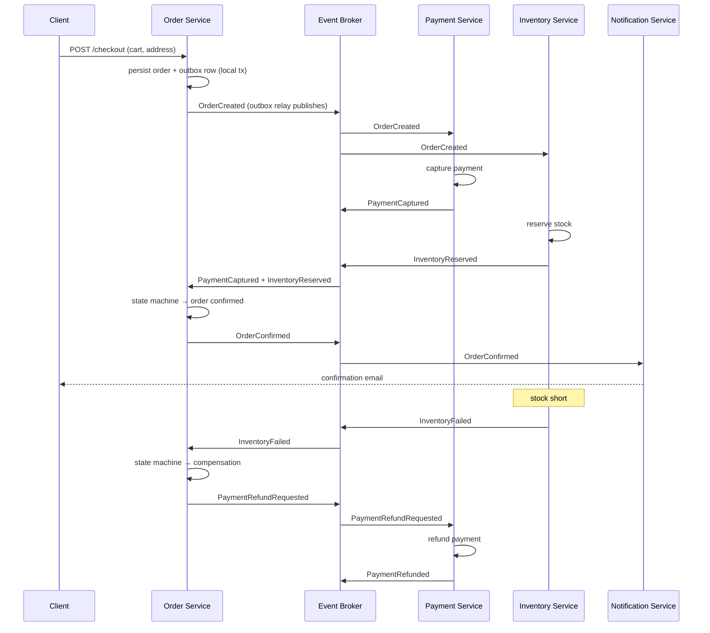

# Microservices Patterns

Microservices split a system into small, independently deployable services, each owned by one team and owning its own data. The value is organizational: independent deploys, independent scaling, and a contained blast radius — but every one of those wins comes with a distributed-systems tax: cross-service consistency, partial failure, and contract drift. This skill is the playbook for paying that tax deliberately: deciding whether decomposition is warranted, finding the boundaries, and applying the canonical patterns for communication, consistency, resilience, observability, testing, and deployment.

## Quick Reference

| Topic | Reference |
|-------|-----------|
| Sagas, compensating actions, and the outbox pattern | [saga-outbox.md](references/saga-outbox.md) |
| Timeouts, retries, circuit breakers, bulkheads, load shedding | [resilience-patterns.md](references/resilience-patterns.md) |
| Structured logs, RED metrics, OpenTelemetry tracing, health probes | [observability-tracing.md](references/observability-tracing.md) |

## Core Workflow

Use this sequence whenever you are architecting or re-architecting toward microservices:

1. **Decide** — confirm decomposition is warranted using the decision table below; if not, design a modular monolith instead.
2. **Find boundaries** — map subdomains and bounded contexts; one service per context (or per core subdomain).
3. **Choose communication** — per service relationship, pick async events, messages, or sync request/reply.
4. **Make data consistent** — where a business operation spans services, design a saga; use the outbox pattern for reliable event publishing.
5. **Harden every call** — timeouts, retries, circuit breakers, bulkheads around each dependency.
6. **Make it observable** — structured logs with trace IDs, RED metrics, distributed tracing, health/readiness endpoints.
7. **Protect the contracts** — contract tests (e.g., Pact) between producers and consumers; per-service test strategy.
8. **Deploy independently** — per-service pipelines, feature flags, canary releases.

## Microservices vs. Modular Monolith

Decomposition is a tradeoff, not a win. Decide before you split:

| Criterion | Microservices | Modular Monolith |
|---|---|---|
| Team size | Multiple teams, each owning a service (Conway's Law) | One team or one small team |
| Scaling | Independent scaling of hot services | Scale the whole app |
| Blast radius | Failure contained to one service | Failure takes down the app |
| Data autonomy | Each service owns its database | One database (still modular schemas) |
| Deploy cadence | Independent deploys per service | One deploy for everything |
| Operational cost | High: N services × (pipeline, tracing, infra, on-call) | Low |
| Consistency | Eventual across services; sagas for multi-service flows | Local ACID transactions |
| Latency | Network hop + serialization per call | In-process calls |

**Rule of thumb:** start as a modular monolith with clean module boundaries, and extract a module into a service only when a concrete pressure appears — a second team needs independent ownership, the module must scale independently, or it needs a different deploy cadence. Extract with the strangler fig pattern (route traffic module-by-module to the new service).

## Decomposition

### Finding service boundaries

- Use **subdomains**: core (competitive advantage — invest here), supporting, generic (buy, don't build). Core subdomains become first-class services.
- A **bounded context** (from DDD) is the natural service boundary: one service ≈ one context, speaking one ubiquitous language.
- A service should be the **smallest thing one team can own and deploy independently** — size in lines of code is a red herring.
- Aim for high cohesion inside a boundary, low coupling across it. If two modules always change together across a network call, they were one module.

### Database-per-service

Each service owns its data exclusively — no shared database:

- Other services never read or write another service's tables; they call its API or consume its events.
- A shared database is the fastest route to a **distributed monolith**: schema changes ripple, writes couple transactions, and services cannot deploy independently.
- Even on one physical database server, keep services separate: own schemas, no cross-schema foreign keys, no cross-schema joins in queries.
- Analytics/reports read from a denormalized read model fed by events (see CQRS), not from production tables.

## Service Communication

### Sync vs async

| | Sync (REST / gRPC) | Async (events / messages) |
| | --- | --- |
| Caller needs | The result now | To hand off work |
| Coupling | Temporal + structural (caller blocks) | Temporal decoupling (broker buffers) |
| Availability | Caller fails if callee is down | Callee can be down; work queues up |
| Consistency | Natural fit for request/reply | Eventual consistency by design |
| Fan-out | One event, many subscribers | Caller orchestrates N calls |
| Failure handling | Timeouts, retries, circuit breakers | Retry queues, DLQs, idempotent consumers |
| Use for | CRUD, queries, commands needing a result | State changes other services care about |

### Choosing the transport

| Question | Lean toward |
|---|---|
| Does the caller need the answer? | Sync (REST or gRPC) |
| Do many services need to react? | Event (pub/sub) |
| Does work need durable queuing and retries? | Message queue (competing consumers) |
| High throughput, typed contracts, internal calls? | gRPC |
| Public API, broad client compatibility? | REST (HTTP/JSON) |

- Publish **integration events** (OrderCreated, PaymentCaptured) at context boundaries — named in the business language, not internal implementation events.
- Keep sync call chains shallow. A → B → C → D synchronous chains multiply latency, couple availability, and turn one slow service into a system-wide outage; break them with events or a saga.

## Distributed Transactions

Two-phase commit across services is an anti-pattern (global locks, coordinator, low availability). Use a **saga**: a sequence of local transactions, each with a compensating action to undo it.

| | Choreography | Orchestration |
| | --- | --- |
| Coordination | None — services react to events | Central orchestrator (state machine) |
| Coupling | Services coupled to event schema only | Services coupled to orchestrator commands |
| Visibility | Flow implicit, spread across services | Flow explicit in one place |
| Failure handling | Distributed — each participant compensates | Centralized — orchestrator drives compensation |
| Setup cost | Low, but hard to trace | More infrastructure, easier to manage |
| Best for | Simple chains, few participants | Complex flows, many participants, visibility matters |

Rules for both styles:

- Compensating actions are **business-level undos**, not DB rollbacks: cancel the order, refund the payment, restock the inventory.
- Compensations must be **idempotent** and handle partial failure — a saga can fail while compensating.
- Every participant must react to success and failure events (or timeouts that trigger compensation).

### The outbox pattern

A saga's events must be published **reliably** — an event lost between "order saved" and "event published" breaks the whole flow. The outbox makes the DB write and the event publication atomic:

1. In the **same local transaction** that changes state, write a row to an `outbox` table.
2. A relay (polling publisher, or CDC such as Debezium) publishes outbox rows to the broker.
3. The broker delivers **at-least-once**, so consumers must deduplicate (idempotent consumers).

See [saga-outbox.md](references/saga-outbox.md) for schemas, relay implementations, and a full orchestrated saga example.

## CQRS and Event Sourcing

Apply these per bounded context, never globally.

| Pattern | When it helps | Costs |
|---|---|---|
| **CQRS** (separate read/write models) | Reads and writes have different shapes or loads; complex queries; read-heavy services | Duplicated storage, eventual consistency between models, more moving parts |
| **Event Sourcing** (events = source of truth; state is a projection) | Audit trail required, temporal queries ("state as of date"), replay/recompute | Event schema evolution, projection maintenance, steep learning curve, hard deletes |

- Use events as the **integration mechanism** between services even when you do *not* use event sourcing internally — the two decisions are independent.
- Event sourcing gives you reliable integration events for free (domain events are the audit log); CQRS read models are a natural fit for feeding other services' data.
- Neither fixes a badly drawn boundary; both add operational surface. Start without them and add only where the requirements demand.

## API Gateway, Service Discovery, and BFF

### API gateway

One entry point for external clients: routing, authN/authZ, rate limiting, TLS termination, response aggregation.

- Keep the gateway **thin** — routing and cross-cutting concerns only. Business logic in the gateway creates a god-object everyone deploys together (a monolith in disguise).
- **BFF pattern**: one backend per client type (web, mobile, third-party) that tailors responses and aggregates the few calls each client needs; the gateway stays generic.

### Service discovery

| Approach | How it works | Where it fits |
|---|---|---|
| Client-side | Service registers; client queries the registry and load-balances | Custom registries (Consul, etcd); full control |
| Server-side | Load balancer / proxy queries the registry and routes | Kubernetes (Service + DNS), Envoy, service mesh |

- Modern default: **Kubernetes DNS + ingress/service mesh** — you rarely build discovery yourself.
- Register instances on startup, deregister on graceful shutdown, and heartbeat.

## Resilience

Every remote call is a failure waiting to happen. Apply the patterns in layers:

| Pattern | Problem it solves | Key parameters |
|---|---|---|
| **Timeout** | Slow or stuck dependency holds resources | Connect + read timeouts; an overall deadline per call |
| **Retry** | Transient failures (timeouts, 5xx, connection resets) | 2–3 attempts, exponential backoff + jitter; **only for idempotent calls** |
| **Circuit breaker** | Repeated failure → fail fast, stop hammering | Failure-rate threshold, open window, half-open probe |
| **Bulkhead** | One dependency exhausts the shared thread pool | Per-dependency thread pool / semaphore limits |
| **Fallback** | Dependency down → degraded response | Cached/stale data, default value, queue for later |
| **Load shedding** | Overload → protect the service | Queue depth limits, 429 responses, shed low-priority work |
| **Idempotent consumers** | At-least-once delivery → duplicate effects | Dedupe on event/request ID; idempotency keys |

Rules:

- **Timeouts first.** Set defaults (e.g., 300 ms connect / 2–5 s read) and tune from measured p99s.
- **Retry with jitter.** Exponential backoff with full jitter avoids thundering herds: `sleep = random(0, min(cap, base * 2^attempt))`.
- **Breaker before flood.** A circuit breaker stops retries from amplifying an outage.
- **Idempotency everywhere.** Retries and replayed events are guaranteed; make effects safe (e.g., an `Idempotency-Key` header, dedupe by event ID).

See [resilience-patterns.md](references/resilience-patterns.md) for concrete configs and code.

## Observability

Make every service answer three questions: is it up, is it healthy, what is it doing?

- **Structured logs** — JSON with `timestamp`, `level`, `service`, `trace_id`, `event`. Searchable and correlate-able.
- **Metrics** — RED (Rate, Errors, Duration) per service; USE (Utilization, Saturation, Errors) per resource. Expose counters, gauges, and latency histograms (p50/p95/p99).
- **Distributed tracing** — OpenTelemetry SDK in every service; propagate the W3C `traceparent` header across sync calls and carry trace context in event/message headers; one trace per user request spanning all services.
- **Health vs readiness** — `/healthz` (liveness: is the process alive?) and `/readyz` (readiness: can it serve traffic? DB reachable? queues drained?). Orchestrators restart on liveness failure; load balancers stop routing on readiness failure.

Details and code in [observability-tracing.md](references/observability-tracing.md).

## Testing

- **Unit tests** — business logic inside a service, no I/O.
- **Contract tests (consumer-driven, e.g., Pact)** — the *consumer* defines the expected interaction; the *producer* verifies it in CI. Contracts replace fragile cross-service integration test suites and catch contract drift before deploy.
- **Integration tests** — per service against real dependencies (Postgres, broker) via testcontainers; a few end-to-end happy paths across real services in staging.
- Test each service like its own product: contract tests + integration tests in its own pipeline, so any service can be deployed safely without coordinated testing.

## Deployment

- **Independent deployability is the point.** Per-service pipeline, independent versions, no lockstep deploys. If you must deploy services together, you have a distributed monolith.
- **Backward-compatible changes:** additive API fields, consumer-driven contracts verified first, versioned endpoints (`/v2`) for breaking changes.
- **Feature flags** decouple deploy from release — ship code dark, flip flags per audience, kill-switch without a redeploy.
- **Canary releases:** route a small percentage of traffic to the new version, compare RED metrics, auto-rollback on regression, then ramp.

## Worked Example: Checkout as Event Choreography

Splitting checkout into Order, Payment, Inventory, and Notification services. Consistency is handled by a choreographed saga: each service publishes events from its outbox, and the Order service runs a state machine.

Failure path: no two-phase commit anywhere — `InventoryFailed` triggers `PaymentRefundRequested`, and every consumer is idempotent against redelivery. Each event is published via the outbox, so nothing is lost between the DB write and the broker.

## Anti-Patterns to Avoid

- **Distributed monolith**: shared database, chatty sync calls, coordinated deploys, shared code library that couples services.
- **Two-phase commit across services** — global locks and low availability.
- **Splitting for its own sake**: 15 services for a 3-person team pays the distributed-systems tax without the organizational benefit.
- **Retries without idempotency** — duplicate charges, duplicate orders, double-sent emails.
- **No timeouts, or too-long timeouts** — resource exhaustion turns one slow service into an outage.
- **Synchronous chains** (A→B→C→D) as the default communication style.
- **Smart gateway** doing business logic, with services reduced to CRUD shells behind it.
- **Event schema drift** without contract tests — consumers break in production.
- **Treating eventual consistency as a bug** instead of designing for it (sagas + compensating actions).
- **Services that cannot be deployed independently** — you built a monolith with extra network hops.

## When to Use / Not Use

**Use microservices when:**
- Multiple teams need independent ownership and deploy cadence (Conway's Law alignment).
- Hot components must scale independently of the rest of the system.
- A component needs tight blast-radius isolation (payment, billing).
- Polyglot persistence or language genuinely fits different components.

**Do NOT use microservices when:**
- A small team (or one) owns the whole system — a modular monolith is faster to build and operate.
- The domain is one tightly coupled transactional workflow — cross-service sagas add pain without benefit.
- The team lacks operational capacity (no tracing, no on-call maturity) — the tax exceeds the benefit.
- You cannot name the boundaries yet — decompose the *domain* first, or you will decompose into a distributed monolith.
